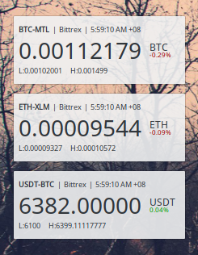

# Minotaur Plasmoid
A KDE Plasma 5 Plasmoid for monitoring cryptocurrency exchange rates on various exchanges

## Installation
To install manually, run the following while in repo directory:
```
kpackagetool5 -t Plasma/Applet --install plasmoid
```

To upgrade manually, run the following while in repo directory:
```
kpackagetool5 -t Plasma/Applet --upgrade plasmoid
```

## Screenshot

